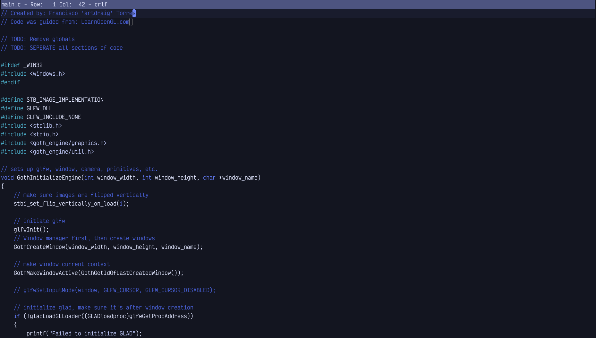

# Drawbridge-Theme-4coder
Drawbridge theme ported into 4coder :D

Font Used: Vector Mono

# Install
Download 'theme-drawbridge.4coder', then drop 'theme-drawbridge.4coder' into the 'themes' folder in 4coder!

# Credits
Original VSCode Theme: Drawbridge (From August Themes By inci-august)

Base2Tone Colorschemes (Including Drawbridge) By: Bram de Haan 
